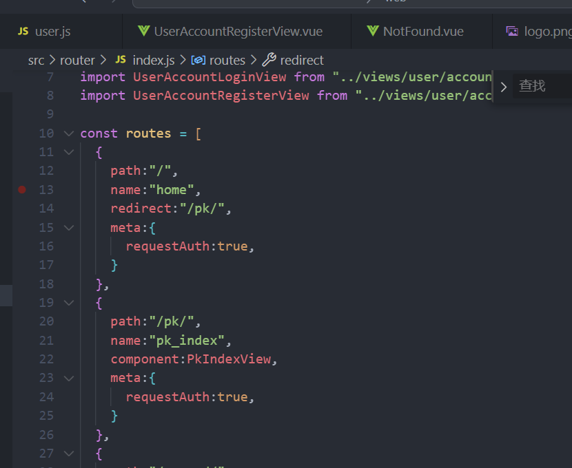
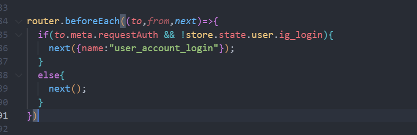
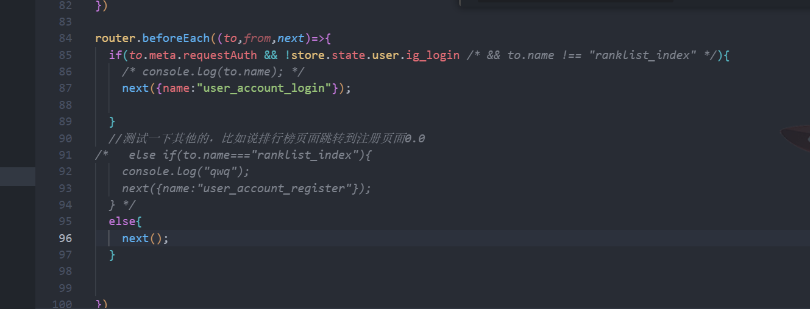
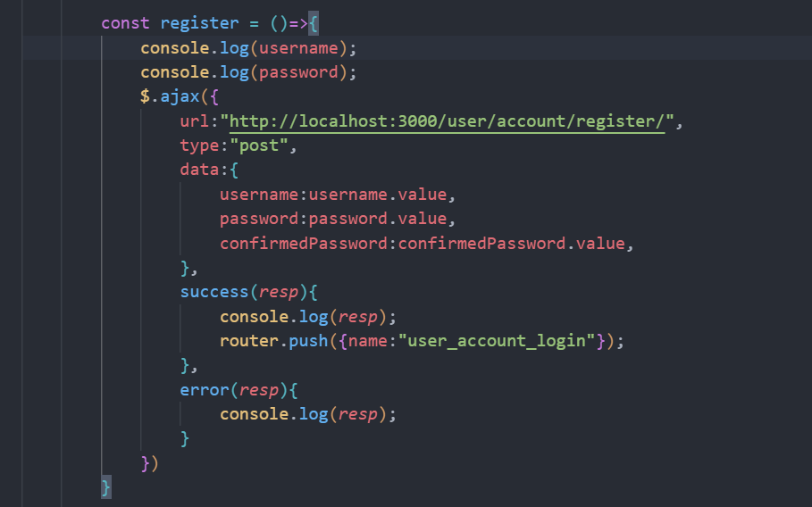
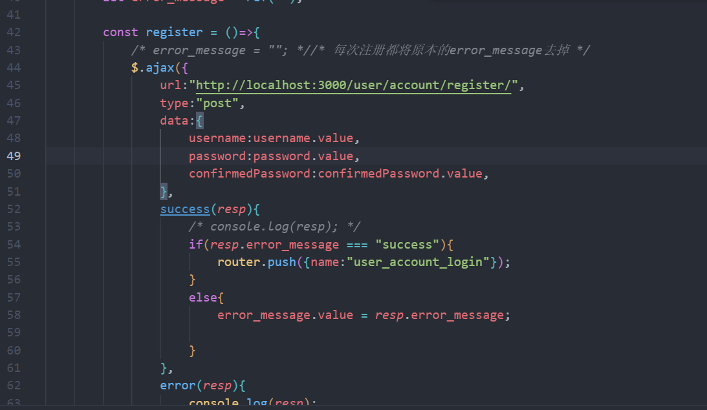
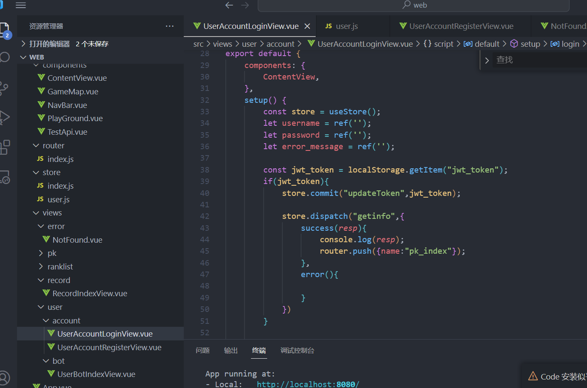
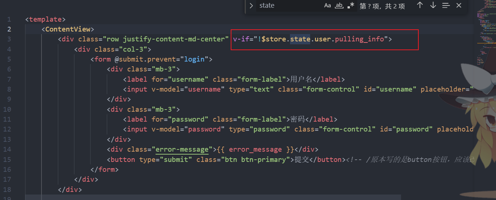
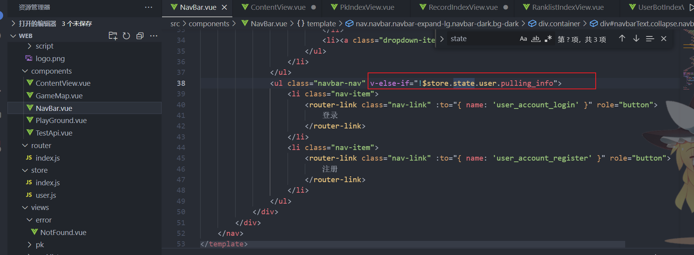
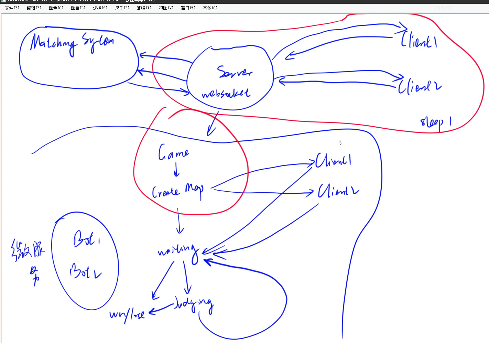

## 一个伟大的项目！

### 4.3 配置Mysql与注册登录模块（下）

#### 实现前端授权

通过router判断是否需要授权，并且通过store判断当前页面的登录状态来决定是否需要跳转到login页面

meta:表示额外信息，包括是否需要授权，登录状态

小扩展：

#### 实现注册页面

这部分主要是在login页面copy一下，修改一下多个confirmedPassword按钮

以及将登陆逻辑修改成注册逻辑，注册成功后跳转到登录页面（注意要将数据库启动--）

奇怪的一点：

不能在每次注册的时候都将原本的error_message设置为空，不懂为什么，去掉这个之后就可以实现error_message显示内容了，同时修改下error-message的css样式

#### 登录状态的持久化（放到localStorage）

由于token是存放在内存当中的，在每次刷新后，token就会消失，因而每次都会跳转到login页面，我们可以将token存放在localStorage当中，然后，在每次刷新的时候，会跳转到login页面，我们在login页面当中，将存放在浏览器的token交给login去判断是否合法，如果合法，则跳转到家页面，也就是pk页面。

##### y总的优化

由于每次刷新的时候，我们会加载login页面，因而对于存放的有效token而言，我们在跳转到家页面之前会先加载login页面的内容，（也就是会闪过一下），我们可以存放一个pulling_info，如果在拉去信息的时候，我们则不加载login页面的内容，这样就可以避开闪过一下的问题，使得页面看起来流畅一些。

怎么实现不加载login内容呢？也就是通过store全局变量，将login内容div做一个v-if绑定，如果当前在拉去内容，那么则不加载login的内容，同理对于导航栏的注册、登录两个按钮而言，我们也是做相同处理。

### 6.1 实现微服务：匹配系统（上）

